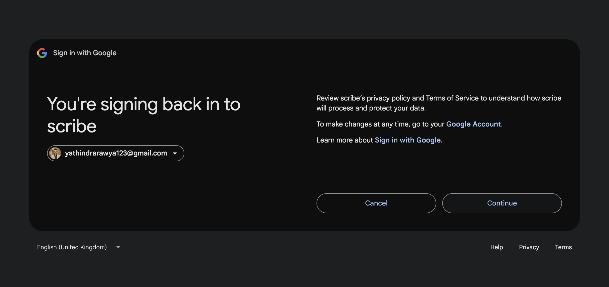
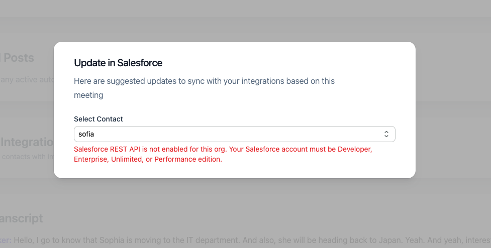
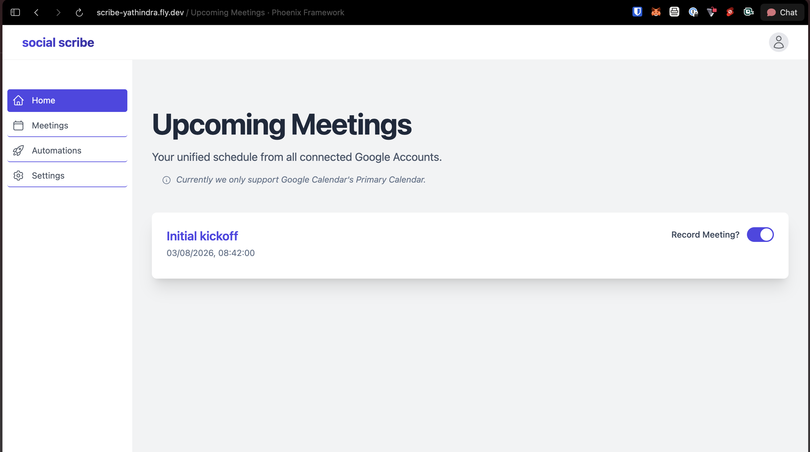
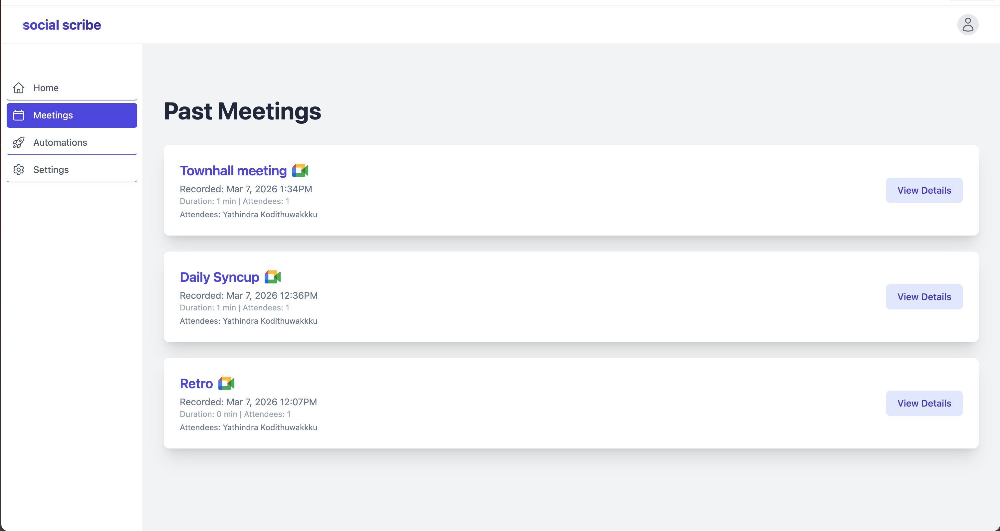
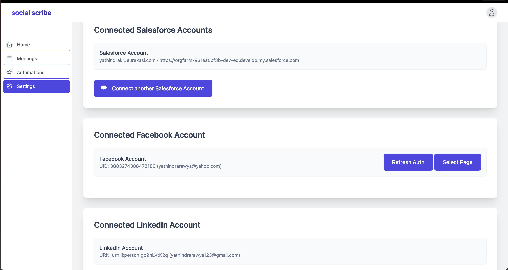
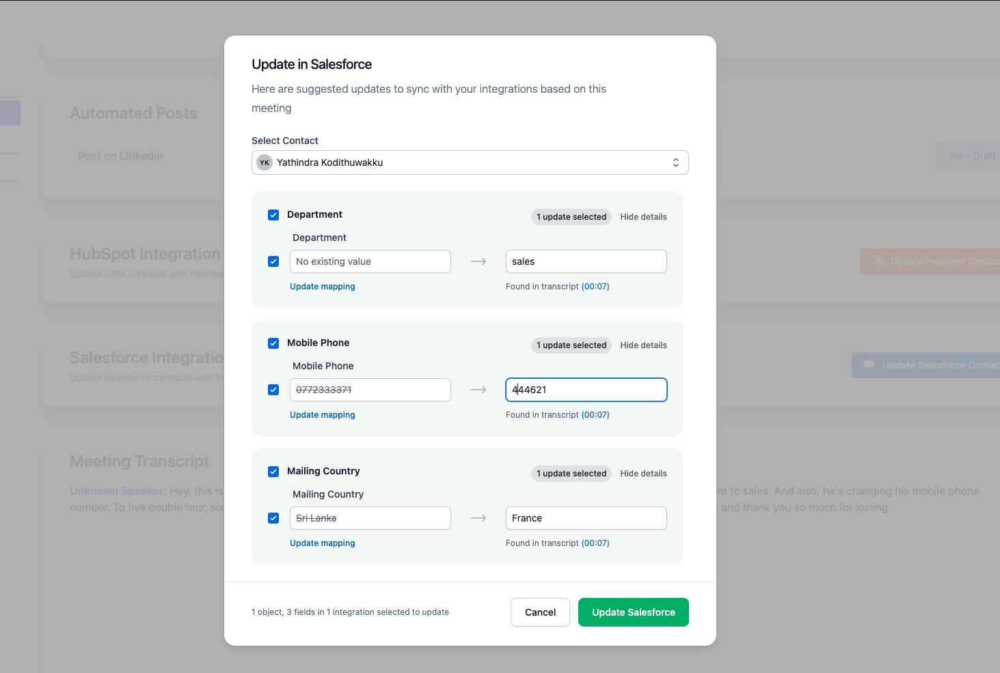
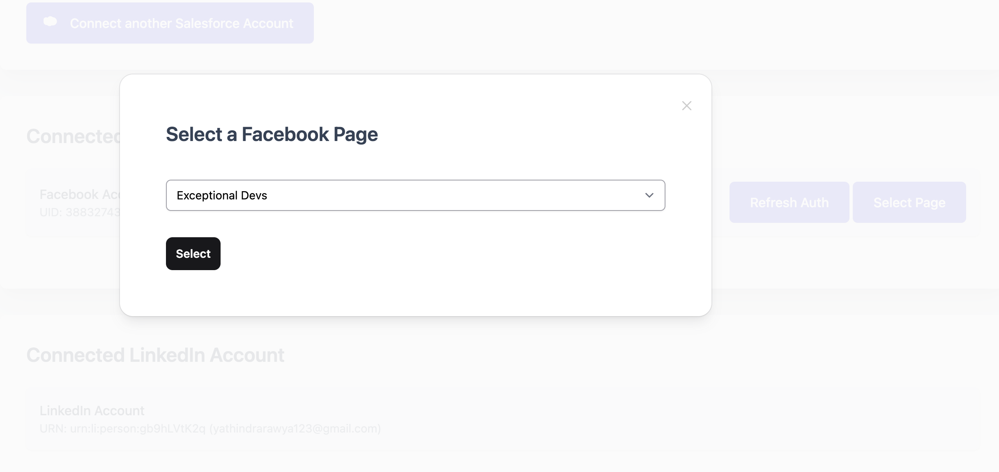
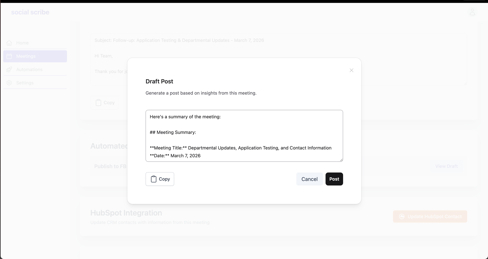
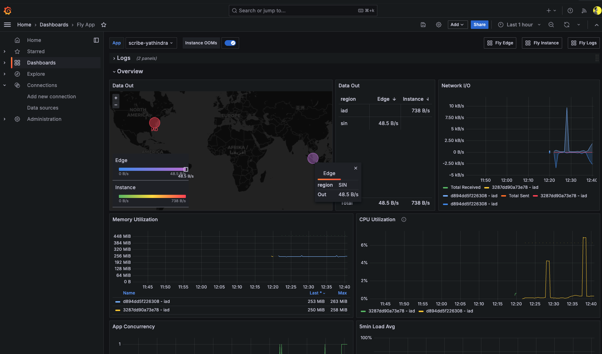

# Social Scribe

**Stop manually summarizing meetings and drafting social media posts! Social Scribe leverages AI to transform your meeting transcripts into engaging follow-up emails and platform-specific social media content, ready to share.**

An Elixir + Phoenix LiveView app that connects to your Google Calendar, sends an AI notetaker to your meetings via Recall.ai, transcribes them, and then uses Google Gemini to generate follow-up emails, social media posts, and CRM contact update suggestions.

**Live:** https://scribe-yathindra.fly.dev

**Status page:** [http://scribe.openstatus.dev/](http://scribe.openstatus.dev/) — uptime and incident history powered by OpenStatus.

 *(via [Coveralls](https://coveralls.io))*

---

## Table of Contents

- [Features](#features)
- [App Flow & Screenshots](#app-flow--screenshots)
- [Tech Stack](#tech-stack)
- [Getting Started](#getting-started)
- [CRM Setup](#crm-setup)
- [Functionality Deep Dive](#️-functionality-deep-dive)
- [HubSpot Integration](#-hubspot-integration)
- [What Was Newly Added](#what-was-newly-added)
- [Running Tests and Coverage](#running-tests-and-coverage)
- [Production Deployment](#production-deployment)
- [Known Limitations](#known-limitations)
- [Learn More](#-learn-more-phoenix-framework)

---

## Features

### Meeting pipeline

- **Google Calendar sync** — Connect one or more Google accounts; upcoming events appear on the dashboard automatically.
- **AI notetaker dispatch** — Toggle "Record" on any event with a Google Meet or Zoom link. A Recall.ai bot joins the meeting a configurable number of minutes before start.
- **Transcript & participants** — After the call ends a background poller (`BotStatusPoller`) detects completion, fetches the transcript and participant list, and stores them locally.
- **Follow-up email** — `AIContentGenerationWorker` uses Gemini to draft a summary email from the transcript.
- **Custom automations** — Users define prompt templates targeting LinkedIn or Facebook; the worker generates platform-specific posts for each active automation and saves them as `AutomationResult` records.

### Social posting

- Connect LinkedIn and Facebook via OAuth on the Settings page.
- Generated automation content can be posted directly to LinkedIn (as the user) or to a managed Facebook Page.
- "Copy" buttons available for all drafts.

### CRM contact enrichment — HubSpot & Salesforce

From any processed meeting, open the HubSpot or Salesforce modal to:

1. Search for a contact by name.
2. Get AI-suggested field updates based on the transcript (e.g. a new phone number mentioned in the call).
3. Review current vs. suggested values side-by-side.
4. Select which fields to apply and sync directly to the CRM.

Both integrations share the same generic `CrmModalComponent` and follow the same internal pattern (OAuth strategy → API client → suggestions module → token refresher worker).

---

## App Flow & Screenshots

* **Login With Google and Meetings Sync:**
    

* **Salesforce API Not Enabled Error for Unsupported Editions:**
    

* **Dashboard View:**
    

* **Past Meetings:**
    

* **Connect Accounts:**
    

* **Update in Salesforce:**
    

* **Automation Configuration UI:**
    

* **Facebook Page Selection:**
    

* **Facebook / LinkedIn Post:**
    
---

## Tech Stack

| Layer | Technology |
|---|---|
| Backend | Elixir, Phoenix LiveView |
| Database | PostgreSQL |
| Background jobs | Oban |
| Auth / OAuth | Ueberauth (Google, LinkedIn, Facebook, HubSpot, Salesforce) |
| Meeting transcription | Recall.ai API |
| AI content generation | Google Gemini (Flash) |
| Frontend | Tailwind CSS, Heroicons |

---

## Getting Started

### Prerequisites

- Elixir + Erlang/OTP
- PostgreSQL
- Node.js (for Tailwind asset compilation)

### Dev Setup

#### Option A: Docker (recommended)

Requires [Docker](https://docs.docker.com/get-docker/) with the Compose plugin.

```bash
git clone git@github.com:yathindrak/scribe.git
cd social_scribe
cp .env.example .env   # fill in your credentials
docker compose up -d   # starts PostgreSQL + app in the background
```

Visit [localhost:4000](http://localhost:4000). The first run compiles dependencies and runs migrations automatically. Subsequent starts reuse the cached build volumes and are much faster.

To tail logs: `docker compose logs -f app`

To stop: `docker compose down`

#### Option B: local Elixir

```bash
git clone git@github.com:yathindrak/scribe.git
cd social_scribe
mix setup          # deps.get + ecto.create + ecto.migrate + npm install
source .env && mix phx.server
```

Visit [localhost:4000](http://localhost:4000).

### Environment variables

Copy `.env.example` to `.env` and fill in your credentials:

```bash
cp .env.example .env
```

The example file includes comments linking to where each credential is obtained. At minimum you need Google, Recall.ai, and Gemini to run the core meeting pipeline. The social and CRM integrations are optional and only activate when their credentials are present.

---

## CRM Setup

### Salesforce

> **Note:** Since September 2025, Salesforce requires connected apps to be installed in each org. Apps created via the UI are "External Client Apps" which are org-local and don't support multi-tenant OAuth. Use Salesforce CLI to deploy a Classic Connected App instead.

See [docs/salesforce-connected-app-setup.md](docs/salesforce-connected-app-setup.md) for the full setup guide. In brief:

1. Install [Salesforce CLI](https://developer.salesforce.com/tools/salesforcecli) and log in: `sf org login web`
2. Deploy the Connected App metadata: `sf project deploy start --source-dir force-app --target-org <your-username>`
3. Retrieve to get the generated **Consumer Key** → `SALESFORCE_CLIENT_ID`
4. Get the **Consumer Secret** from Setup → App Manager → Scribe Prod → View → Manage Consumer Details → `SALESFORCE_CLIENT_SECRET`

### HubSpot

1. Create an app in the [HubSpot Developer Portal](https://developers.hubspot.com/).
2. Under Auth, set the redirect URI to `http://localhost:4000/auth/hubspot/callback`.
3. Add scopes: `crm.objects.contacts.read`, `crm.objects.contacts.write`.
4. Copy **Client ID** → `HUBSPOT_CLIENT_ID`, **Client Secret** → `HUBSPOT_CLIENT_SECRET`.

---

## ⚙️ Functionality Deep Dive

* **Connect & Sync:** Users log in with Google. The Settings page allows connecting multiple Google accounts, plus LinkedIn and Facebook accounts. For Facebook, after initial connection, users are guided to select a Page for posting. Calendars are synced to a database to populate the dashboard with upcoming events.
* **Record & Transcribe:** On the dashboard, users toggle "Record Meeting?" for desired events. The system extracts meeting links (Zoom, Meet) and uses Recall.ai to dispatch a bot. A background poller (`BotStatusPoller`) checks for completed recordings and transcripts, saving the data to local `Meeting`, `MeetingTranscript`, and `MeetingParticipant` tables.
* **AI Content Generation:**
    * Once a meeting is processed, an `AIContentGenerationWorker` is enqueued.
    * This worker uses Google Gemini to draft a follow-up email.
    * It also processes all active Automations defined by the user. For each automation, it combines the meeting data with the user's `prompt_template` and calls Gemini to generate content (e.g. a LinkedIn post), saving it as an `AutomationResult`.
* **Social Posting:**
    * From the Meeting Details page, users can view AI-generated email drafts and posts from their automations.
    * "Copy" buttons are available for all drafts.
    * "Post" buttons allow direct posting to LinkedIn (as the user) and the selected Facebook Page (as the Page).

---

## 🔗 HubSpot Integration (Existing)

### HubSpot OAuth Integration

* **Custom Ueberauth Strategy:** Implemented in `lib/ueberauth/strategy/hubspot.ex`
* **OAuth 2.0 Flow:** Handles authorization code flow with HubSpot's `/oauth/authorize` and `/oauth/v1/token` endpoints
* **Credential Storage:** Credentials stored in `user_credentials` table with `provider: "hubspot"`, including `token`, `refresh_token`, and `expires_at`
* **Token Refresh:**
    * `HubspotTokenRefresher` Oban cron worker runs every 5 minutes to proactively refresh tokens expiring within 10 minutes
    * Internal `with_token_refresh/2` wrapper automatically refreshes expired tokens on API calls and retries the request
    * Refresh failures are logged; users are prompted to re-authenticate if refresh token is invalid

### HubSpot Modal UI

* **LiveView Component:** `HubspotModalComponent` (now unified as `CrmModalComponent`)
* **Contact Search:** Debounced input triggers HubSpot API search, results displayed in dropdown
* **AI Suggestions:** Fetched via `HubspotSuggestions.generate_suggestions` which calls Gemini with transcript context
* **Suggestion Cards:** Each card displays the field label, current value (strikethrough), suggested value, and a timestamp link
* **Selective Updates:** Checkbox per field allows selective updates; "Update HubSpot" button disabled until at least one field is selected
* **Form Submission:** Batch-updates selected contact properties via `HubspotApi.update_contact`
* **Click-away Handler:** Closes dropdown without clearing selection

---

## What Was Newly Added

The following were built on top of the existing codebase:

### API Resilience & Retries

All external API integrations (HubSpot, Salesforce, Facebook, LinkedIn, Google Calendar, Recall.ai, and Gemini) now utilize `Tesla.Middleware.Retry` with automatic exponential backoff. This ensures robust handling of transient network errors (`:econnrefused`), rate limits (`HTTP 429`), and service unavailability (`HTTP 503`) without failing background jobs or dropping requests.

### Salesforce integration

A full OAuth 2.0 integration built, following the layered pattern as HubSpot:

- **OAuth strategy** — Custom Ueberauth strategy handles the authorization code flow and token exchange.
- **REST API client** — SOQL-based contact search and PATCH updates against the Salesforce v59.0 REST API, with a behaviour module for Mox testability.
- **AI suggestions** — `SalesforceSuggestions` calls Gemini with the transcript and merges results with existing contact data.
- **Token refresh** — An on-demand refresher wraps API calls and retries on 401; a background Oban cron worker proactively refreshes tokens every 5 minutes.
- **Multi-tenancy** — Each Salesforce org has a unique `instance_url` returned at OAuth time. A migration adds this column to `user_credentials` so every API call hits the right org.

### Generic CRM modal

`CrmModalComponent` was refactored from a HubSpot-specific component into a single generic component driven by a `:crm` atom (`:hubspot` or `:salesforce`). Adding a new CRM requires only a new clause in `crm_modules/1` in `MeetingLive.Show`.

### HubSpot improvements

Building the Salesforce integration surfaced several inconsistencies in the existing HubSpot code. The suggestions flow was tightened to go through the behaviour contract (enabling proper Mox mocking in tests), field lookup was made more robust, and change detection was aligned to use the same case/whitespace normalisation as Salesforce. The token refresh worker also had a silent error-discarding bug that was cleaned up. The Gemini prompt for generating HubSpot suggestions was also improved to produce more accurate and relevant field update candidates from the transcript.

### UI and frontend polish

The landing page CTA is now auth-aware: authenticated users see a "Go to Dashboard" button that routes directly to the dashboard, while guests see the original "Get Started for Free" button linking to Google sign-in. Previously, the button always triggered Google OAuth regardless of login state.

**Bug fix — invalid loading state on CRM update modal:** the original HubSpot modal shared a single `loading` flag across two distinct async phases, causing the "Generating suggestions..." spinner to incorrectly appear when the update was being submitted. When the Salesforce integration was added it inherited the same bug. Fixed by introducing a separate `updating` state so that selecting a contact shows "Generating suggestions..." and submitting the form shows "Updating...", each only for their respective phase. The fix applies to both via the shared `CrmModalComponent`.

Meeting times are now rendered in the user's local timezone rather than always showing UTC. The CRM modal submit button was unified to a single shared colour across both HubSpot and Salesforce rather than maintaining per-CRM overrides.

### Test suite

A `test/integration/` folder was added with a pipeline-level test (`MeetingPipelineTest`) that exercises the full recording flow (calendar sync → bot dispatch → transcript ingestion → AI content generation) as well as end-to-end CRM flows for both HubSpot and Salesforce — with Mox mocks throughout, no network calls or real credentials required.

The three pipelines covered:

1. **Recording pipeline** — calendar sync → bot dispatch → `BotStatusPoller` → meeting/transcript/participants created → `AIContentGenerationWorker` → follow-up email saved.
2. **Salesforce CRM flow** — contact search → AI suggestions → merge with existing contact data → apply updates.
3. **HubSpot CRM flow** — same flow through HubSpot-specific modules.

Unit tests were added for the Salesforce API client, suggestions module, and token refresher — mirroring the existing HubSpot test coverage. The HubSpot token refresher and modal tests were also updated as part of the quality fixes described above.

### Docker-based local development

A `Dockerfile.dev` and `docker-compose.yml` were added so the app and its PostgreSQL database can be started together with a single command — no need to install or run Postgres separately on the host machine. Dependencies and build artifacts are cached in named volumes so rebuilds stay fast.

### Production deployment & Grafana observability

The app is deployed on [Fly.io](https://fly.io) (On pay as you go) with a `fly.toml` config covering the region, HTTPS, auto-start/stop machines, and connection concurrency limits. The production database is hosted on [Supabase](https://supabase.com) (managed PostgreSQL with SSL), connected via `DATABASE_URL` at runtime.

Fly.io provides built-in metrics via its Grafana dashboard to access pre-built graphs for CPU, memory, HTTP request rate, and response latency etc.



---

## Running Tests and Coverage

```bash
mix test                                        # all tests
mix test test/integration/                      # pipeline integration tests only
mix test test/social_scribe/                    # unit + per-module tests
```

### Coverage

```bash
mix coveralls                                   # coverage summary in terminal
mix coveralls.html                              # generates cover/excoveralls.html
```

Quick one-liner to see total and per-file coverage:

```bash
mix coveralls 2>&1 | grep -E "^\[TOTAL\]|^[0-9 ]+\.[0-9]+%"
```

---

## Production Deployment

### Required additional env vars

| Variable | Description |
|---|---|
| `DATABASE_URL` | PostgreSQL connection string |
| `SECRET_KEY_BASE` | Generate with `mix phx.gen.secret` |
| `PHX_HOST` | Your app's domain |
| `PHX_SERVER` | Set to `true` |

### Fly.io

Set secrets from your `.env` (update redirect URIs to your production domain first):

```bash
fly secrets set $(grep -v '^#' .env | grep -v '^$' | sed 's/^export //' | tr '\n' ' ')
fly deploy
# If want to run on a single node
fly scale count 1
```

Or set them individually via `fly secrets set KEY=value`.

---

## Identified Limitations

- **Google Meet recall bot sign-in restriction** — If the meeting was created by a Google Workspace (institutional) account with "Only signed-in users can join" enforced, the Recall.ai bot will be rejected with a `meeting_requires_sign_in` error. This is a Google Meet policy restriction; the bot joins anonymously by default and cannot bypass org-level authentication requirements.
- **Salesforce edition requirement** — The Salesforce REST API is only available on **Developer, Enterprise, Unlimited, and Performance** editions. Starter/Essentials and Group editions block all API access with an `API_DISABLED_FOR_ORG` error — this cannot be configured away. The app surfaces a clear error message in this case (see [screenshot](readme_assets/salesforce_api_not_enabled.png)). For testing, use a free [Salesforce Developer Edition](https://www.salesforce.com/products/free-trial/developer/) org which includes full REST API access. This is a Salesforce licensing restriction confirmed in their [official documentation](https://developer.salesforce.com/docs/atlas.en-us.api_rest.meta/api_rest/intro_rest_compatible_editions.htm).
- **Facebook app review** — Posting to Facebook Pages works for app admins/testers without Meta's app review. Broader access requires Business Verification through Meta.
- **Calendar event parsing** — Only events with a `hangoutLink` or a `location` containing a Zoom URL are synced. Other meeting platforms are not yet supported.
- **Automation prompt templating** — Basic string substitution; a more capable templating engine (EEx or similar) would be a future improvement.

---

## 📚 Learn More (Phoenix Framework)

* Official website: https://www.phoenixframework.org/
* Guides: https://hexdocs.pm/phoenix/overview.html
* Docs: https://hexdocs.pm/phoenix
* Forum: https://elixirforum.com/c/phoenix-forum
* Source: https://github.com/phoenixframework/phoenix
